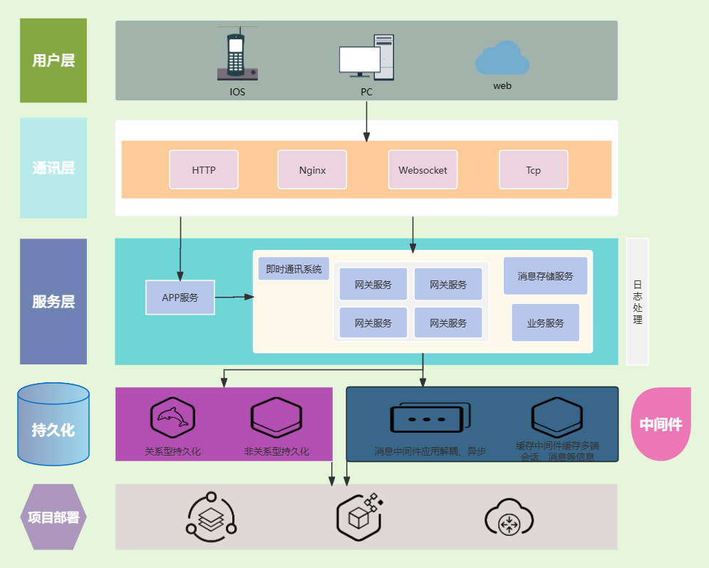
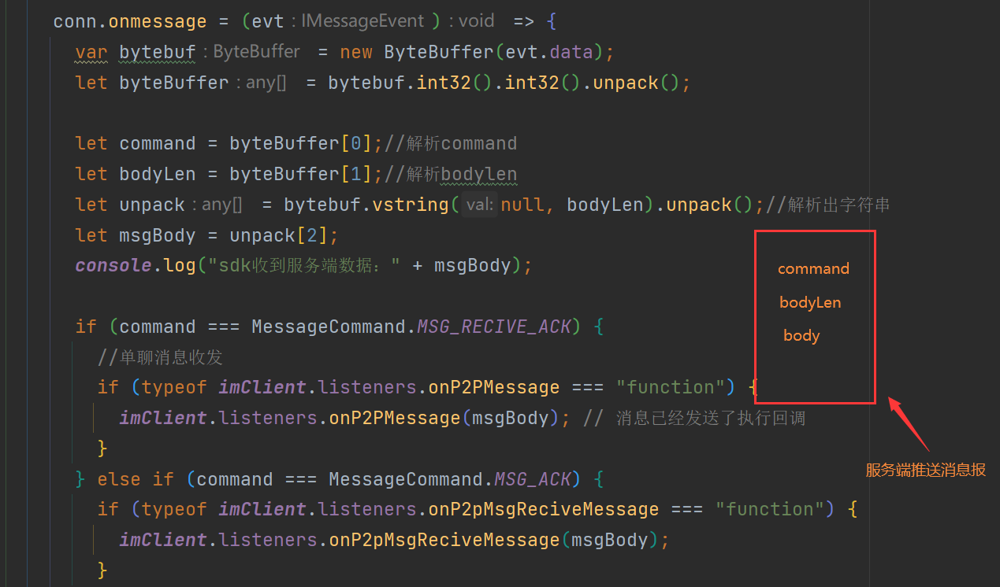
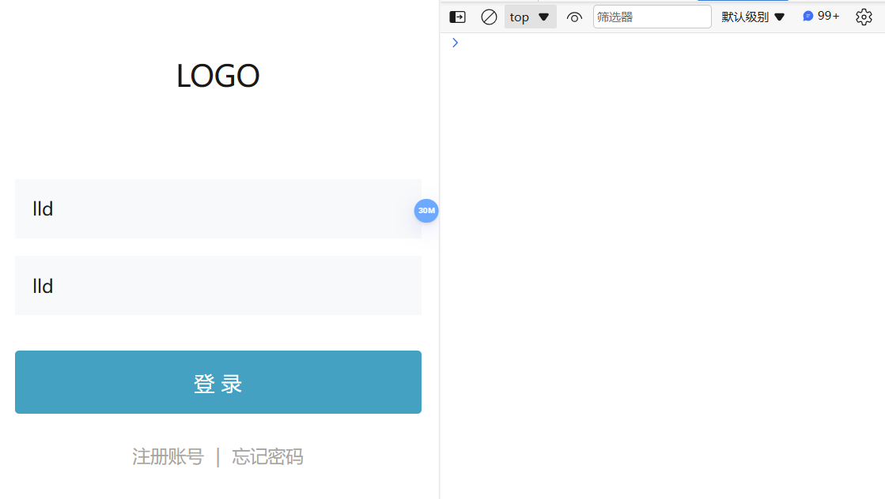
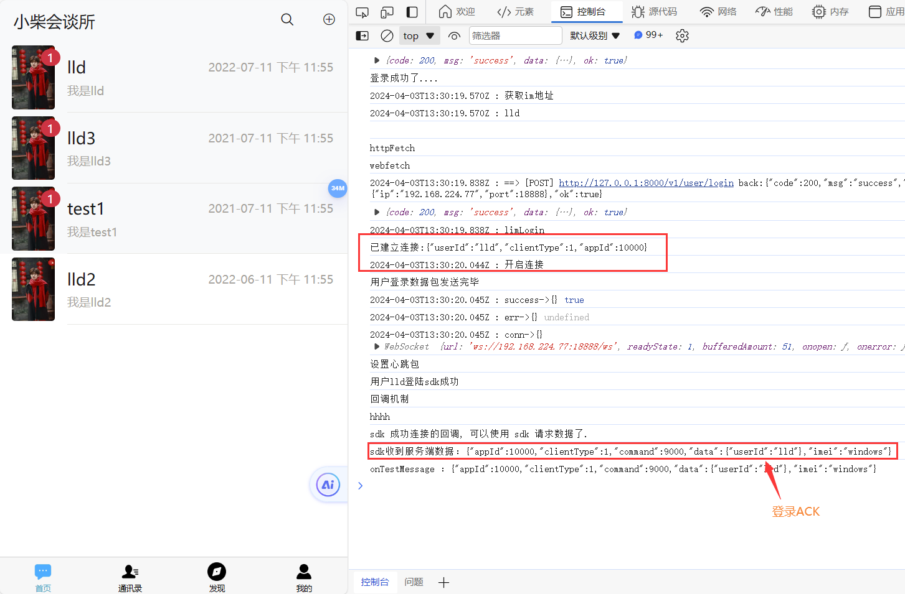
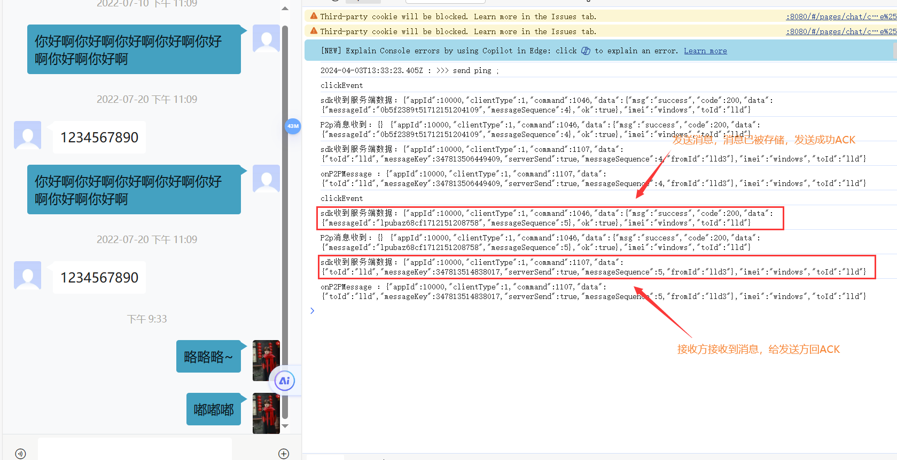

# 功能简述

该系统服务于消息通信，支持多端登录，多端数据同步，通过SDK对接该系统后可以实现好友、群会话之间的消息通信，当然也提供了好友在线状态的显示、好友分组等功能，主要模块可分为用户模块、好友模块、群组模块、消息模块。

# 技术选型

|   技术栈   |
| :--------: |
| SpringBoot |
|   Netty    |
| Zookeeper  |
|  Mybatis   |
|   Redis    |
|   MySQL    |
|  RabbitMQ  |
| OpenFeign  |

下面简单画个登录流程是怎么个流程的吧（用的 mspaint 画的，有点丑）

# 我写的这个即时通讯和网上的IM有啥不一样？

这个即时通讯系统一共有四个服务：APP服务、网关服务、业务服务、存储服务

* APP服务主要就是处理登录、注册、回调逻辑的，主要是去对接APP的。

* 而网关服务、业务服务、存储服务可以称为是即时通讯系统了。

* 网关服务主要做长连接处理（Channel本地缓存）、路由消息给业务处理，完了然后写消息给用户

* 业务服务除了处理消息业务逻辑然后路由回给网关外，还提供获取网关服务地址的接口，当然好友模块、请求模块、群组模块、消息模块都是在这个模块下完成的。

1. 它是通过解析数据报，然后获取到对应数据和字段，得到多端参数，大家可以帮忙看看提点建议
   * command：命令类型，后端用于路由的，编写SDK的时候用于判断咋回调的，也可以认为是路由吧；
   * clientType：端登录的类型（Web、IOS、PC）
   * appId：对接这个即时通讯的appId，因为可以有多个不同系统对接嘛，那避免和系统冲突，就搞了个这个字段。😁
   * messageType：消息类型
   * imeiLen：imei长度
   * bodyLen：消息长度
   * imei
   * body

2. 项目是集群架构的，项目中是使用Netty实现的websocket，那和用户连接的就是对应的Channel，需要给用户推送消息的时候，就往Channel里面write消息就好了，但是Channel是只能存在本地的，如何保障消息可以正确推送呢？
   * 我给每个网关服务配置了一个brokerId，表示这个服务实例的唯一性，然后业务服务通过RabbitMQ发送消息的时候，带上这个brokerId，然后路由到对应的网关服务，它们再从本地去拿Channel去推送消息
3. 通讯系统当然处理消息才是关键，我的即时通讯系统里保障了消息保障了有序、实时、幂等、可靠性
   * 有序性是通过Redis维护了个消息序列号seq，交由前端排序
   * 可靠性是让消息接收方接收到后，再回一个ACK过来，然后发给发送方，这样就确保了消息的正确收发，当然消息发送后被存储了会回一个ACK会消息发送方，这是由服务端操作的
   * 幂等性主要是由可靠性引起的，若没保障正确收到ACK的话会进行重发。我是通过在Redis中维护一个消息id，如果当前消息发送过了，就不会再让他走存储逻辑了
   * 实时性主要就是为了快速响应，首先是在网关服务的时候就通过了OpenFeign进行了提前校验这消息是否可发，然后业务服务接收到这个消息发送时，又会使用线程池去处理业务逻辑，在此过程中涉及到消息存储会使用MQ异步到消息存储服务去进行，这样可以更快的进行ACK处理，从而达到一定实时的效果

# SDK编写、测试

SDK 主要是去处理协议数据报，传数据报、收到消息然后解析，解析完拿到 command 字段，通过这个值然后去判断要执行哪些回调，这些回调由客户端传过来，然后SDK这边解析去执行它。

下面是我写的简单页面的测试：

SDK地址：[koxumeiqi/xc-im-font-sdk: 自研即时通讯系统的SDK (github.com)](https://github.com/koxumeiqi/xc-im-font-sdk)

个人微信（有啥问题可以加，骂我的别加我）：Arrest333

